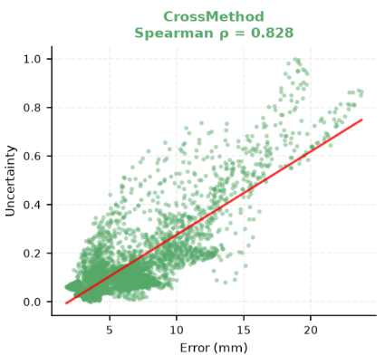
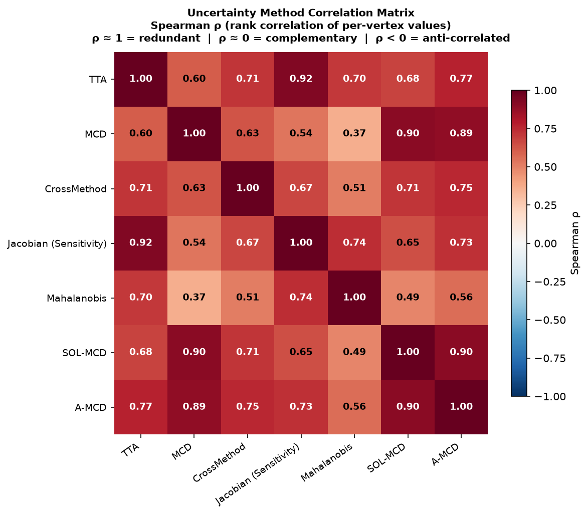
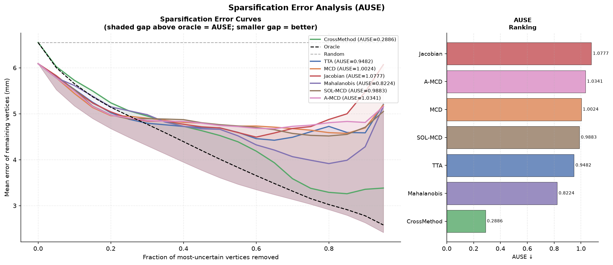
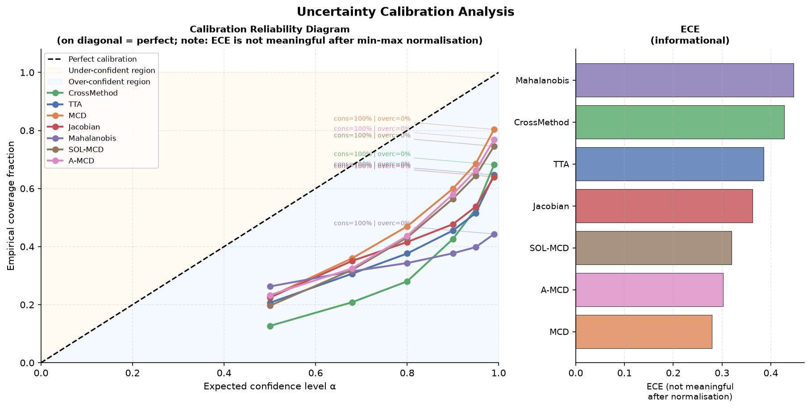
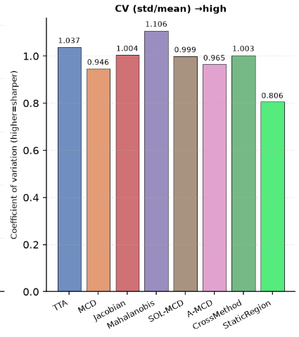
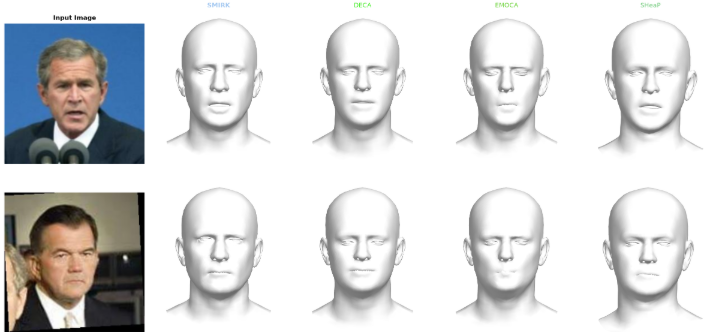
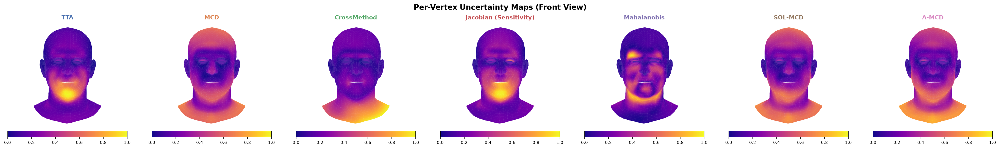
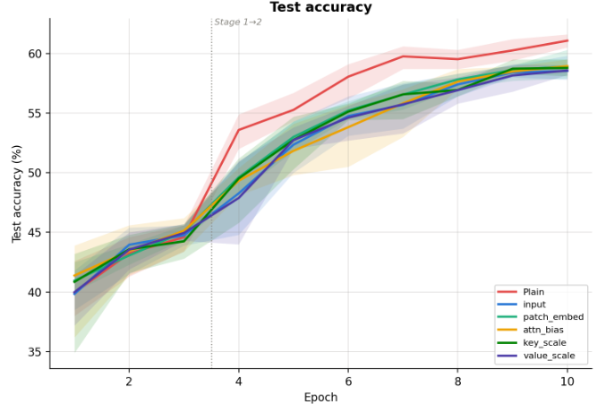
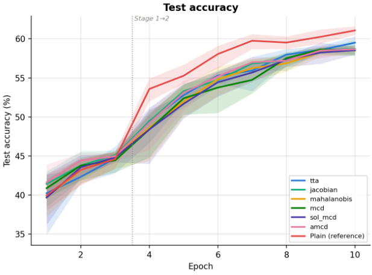
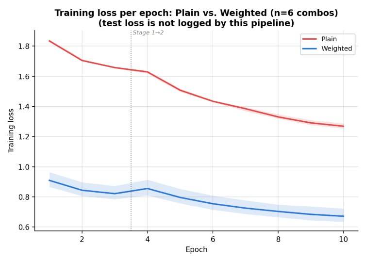

# Uncertainty Estimation in FLAME-Based Monocular 3D Face Reconstruction

**A Comparative Benchmark of Aleatoric, Epistemic, and Cross-Method Approaches, with a Downstream Facial Expression Recognition Study**

Course project for **Computer Vision**, MSc in Data Science and Machine Learning, National Technical University of Athens (NTUA).

---

## Table of Contents

- [a) Introduction](#a-introduction)
- [b) File Organisation](#b-file-organisation)
- [c) Methodology](#c-methodology)
- [d) Results](#d-results)
- [e) Run Commands](#e-run-commands)
- [f) Rights and Licensing](#f-rights-and-licensing)

---

## a) Introduction

### Abstract

Monocular 3D face reconstruction is inherently ill-posed, and current FLAME-based regressors — SMIRK, DECA, EMOCA, and SHeaP — output only a single deterministic mesh with no notion of confidence. Reconstruction error, however, is spatially structured rather than uniform: articulated regions such as the mouth and jaw are reconstructed far less reliably than rigid regions such as the nose bridge. This project presents a systematic benchmark of **per-vertex uncertainty estimation** for FLAME meshes (5,023 vertices), covering three complementary uncertainty axes:

- **Aleatoric uncertainty** — Test-Time Augmentation (TTA), Jacobian Sensitivity, Mahalanobis distance in vertex space.
- **Epistemic uncertainty** — Monte Carlo Dropout (MCD) and two variance-reduction variants, SOL-MCD and Antithetic MCD (A-MCD).
- **Methodological uncertainty** — Cross-Method Disagreement among the four independently trained regressors.

All seven methods (plus a non-adaptive `StaticRegion` sanity-check baseline) are evaluated against ground-truth per-vertex reconstruction error on TEMPEH and CoMA, using rank correlation (Spearman ρ), error-ranking quality (AUSE), and probabilistic calibration (NLL, ECE). The estimated uncertainty is then projected into image space and injected into a Vision Transformer at five different points, to test whether it is a useful signal for downstream facial expression recognition on Fer2013.

### Team

| Name | Student ID |
|---|---|
| Mikela Almadhi | 03400282 |
| Stavros Korovesis | 03400297 |
| Konstantinos Leontiadis | 03400302 |
| Tilemachos Notsika | 03400306 |
| Eleni Syka | 03400316 |

*MSc Data Science and Machine Learning, National Technical University of Athens.*

---

## b) File Organisation

```
.
├── main.py                        # CLI entry point — orchestrates all pipeline stages
├── run_experiments.sh              # Bash wrapper: device auto-scaling (CPU/GPU/HPC) + sweeps
├── clear_outputs.sh                 # Deletes ./outputs/
├── requirements.txt                 # Python dependencies
├── main.tex                         # IEEE-format paper / project report
├── references.txt                   # BibTeX bibliography for main.tex
├── plots/                           # Example figures referenced in this README / the paper
│
├── wrappers/                        # One standardised wrapper per FLAME regressor
│   ├── base_wrapper.py                  # BaseFaceRegressorWrapper — abstract interface
│   ├── smirk_wrapper.py                 # SMIRK wrapper (+ optional MCD-dropout checkpoint)
│   ├── deca_wrapper.py                  # DECA wrapper
│   ├── emoca_wrapper.py                 # EMOCA wrapper
│   └── sheap_wrapper.py                 # SHeaP wrapper (JIT model + TinyFLAME)
│
├── src/                              # Core library
│   ├── data_loader.py                    # FaceDatasetLoader — NoW/CoMA/TEMPEH/UTKFace/LFW/RAF-DB
│   ├── inference.py                      # UnifiedFaceRegressor — runs all four wrappers uniformly
│   ├── uncertainty.py                    # The 7 per-vertex uncertainty estimators
│   ├── evaluation.py                     # Geometric error + uncertainty-quality metrics
│   ├── visualization.py                  # All matplotlib figures (headless, CPU-only)
│   ├── hyperparam_tuning.py              # Grid search over uncertainty-method hyperparameters
│   ├── downstream.py                     # 2D projection + UncertaintyWeightedClassifier (ViT/ResNet/GCN)
│   ├── emotion_dataset.py                # EmotionDataset — RAF-DB/Fer2013-style classifier dataset
│   ├── precompute_uncertainty_maps.py    # Batch pre-computation of 2D confidence maps
│   ├── run_classifier_experiment.py      # Standalone plain-vs-weighted classifier trainer
│   └── downstream_tuning.py              # CPU/GPU hyperparameter tuning for the classifier
│
├── scripts/                          # One-off data preparation utilities
│   ├── download_datasets.py              # Prints registration/download instructions, builds skeleton
│   ├── create_partitions.py              # Reproducible, prefix-consistent dataset partitions (JSON)
│   ├── extract_now_images.py             # Pulls the 352 NoW validation images out of a TEMPEH zip
│   ├── extract_tempeh_subset.py          # Extracts an (image, FLAME-registration) subset from TEMPEH
│   ├── organise_fer2013.py               # Reorganises the Kaggle FER2013 dump into class folders
│   └── plot_downstream_results.py        # Parses a Stage-5 log into comparison plots + LaTeX tables
│
└── (created at runtime, not tracked in git — see .gitignore)
    ├── datasets/                     # Downloaded/organised datasets (NoW, CoMA, TEMPEH, ...)
    ├── models/                       # Cloned regressor repos + downloaded checkpoints
    ├── smirk_checkpoint_data/        # Dropout-augmented SMIRK checkpoint used by MCD/SOL-MCD/A-MCD
    ├── partitions/                   # JSON partitions written by scripts/create_partitions.py
    ├── outputs/                      # Everything main.py writes (vertices, figures, JSON reports)
    └── figures/                      # Stage-5 text logs / plots consumed by plot_downstream_results.py
```

**Design note.** `wrappers/` standardises the four regressors behind one interface (`predict_parameters`, `get_vertices`), so every downstream component (`src/inference.py`, `src/uncertainty.py`) can treat SMIRK, DECA, EMOCA, and SHeaP interchangeably. `src/` contains all reusable logic; `scripts/` contains disposable, single-purpose data-wrangling entry points that are run once per dataset setup, not part of the experiment loop itself.

---

## c) Methodology

### The FLAME 3D Face Model

FLAME defines a differentiable mapping $\mathbf{M}(\boldsymbol{\beta}, \boldsymbol{\psi}, \boldsymbol{\theta}) \rightarrow \mathbb{R}^{5023 \times 3}$ from shape ($\boldsymbol{\beta}$), expression ($\boldsymbol{\psi}$), and pose ($\boldsymbol{\theta}$) parameters to a 5,023-vertex mesh, using linear blendshapes plus linear blend skinning over four joints (neck, jaw, two eyeballs). All four regressors below share this exact topology, so meshes are directly comparable vertex-by-vertex without any registration step.

### Face Reconstruction Regressors

| Model | Shape | Expression | Pose / extra | Supervision |
|---|---|---|---|---|
| **SMIRK** | 300-D | 50-D | global + jaw (3-D each), eyelids (2-D) | Neural-renderer cycle-consistency (analysis-by-neural-synthesis) |
| **DECA** | 100-D | 50-D | 6-D + camera (3-D) | Weak-perspective photometric consistency (coarse branch only) |
| **EMOCA** | 100-D | 50-D | 6-D | DECA objective + emotion-discriminative loss (frozen EmoNet) |
| **SHeaP** | 300-D | 100-D | 5 joint rotations + eyelids | Self-supervised 2D Gaussian Splatting, JIT encoder + TinyFLAME |

SMIRK is the backbone for **every single-model** uncertainty estimator (TTA, Jacobian, Mahalanobis, and all three MCD variants); a dedicated checkpoint retrained with `nn.Dropout` in the expression encoder is required for the MCD family.

### Per-Vertex Uncertainty Estimation

All seven methods reduce to a scalar per vertex, $\mathbf{u} \in \mathbb{R}^{5023}$, after Procrustes alignment removes global rigid-body motion:

| # | Method | Axis | Idea |
|---|---|---|---|
| 1 | **TTA** | Aleatoric | Variance of predictions across $N$ augmented copies (jitter, blur, noise, crop/scale, rotation), each aligned to the clean prediction. |
| 2 | **MCD** | Epistemic | Variance across $N$ stochastic forward passes with dropout active (BatchNorm stays in eval mode); normalised by the FLAME expression-basis norm $\|\mathbf{B}^{\mathrm{expr}}_v\|_F$ to remove structural bias toward the mouth/eyes. |
| 3 | **CrossMethod** | Methodological | $\ell_2$ norm of the inter-model standard deviation after 3 iterations of Generalised Procrustes Analysis (GPA) align all four regressors' predictions to their Fréchet mean. |
| 4 | **Jacobian Sensitivity** | Aleatoric | RMS chord displacement from the clean prediction under $K$ deterministically scheduled augmentations — used because finite-difference Jacobians collapse to ≈0 under SMIRK's global spatial pooling. |
| 5 | **Mahalanobis** | Aleatoric | Mahalanobis distance of the test prediction from a Gaussian fit (via low-rank PCA/SVD) over $N_r$ reference-image predictions in vertex space. |
| 6 | **SOL-MCD** | Epistemic | MCD variant that freezes the input-proximal dropout layer(s) deterministic and keeps the output-proximal layer stochastic (reversed relative to the original Stable-Output-Layers paper, tuned empirically for this architecture). |
| 7 | **A-MCD** | Epistemic | MCD with antithetic dropout-mask pairs (`u`, `1−u`) instead of independent sampling, reducing estimator variance ~25–50% for the same compute budget. |
| — | **StaticRegion** | *(sanity check)* | Assigns each vertex its mean error across the evaluation set — a non-adaptive, image-independent prior. Any method that fails to beat it is only capturing dataset-level difficulty, not per-image uncertainty. |

### Evaluation Metrics

- **Geometric quality** (`src/evaluation.py`, Group A): per-vertex RMSE/median L2 error (Procrustes-aligned, mm), scan-to-mesh distance via KD-tree for raw-scan datasets, and a 14-region anatomical breakdown from the official `FLAME_masks.pkl`.
- **Predictiveness** (Group B): Spearman $\rho_{\mathrm{spatial}}$ (averaged spatial maps) and $\rho_{\mathrm{flat}}$ (per-image, un-averaged) — the gap between them quantifies how much of $\rho_{\mathrm{spatial}}$ is inflated by shared structural difficulty (e.g. the mouth being hard in every face). Pearson $r$, per-image $\rho_{\mathrm{img}}$, and Kendall's $W$ (rank stability across images) are also reported.
- **Ranking quality**: Area Under the Sparsification Error curve (**AUSE**) — vertices are progressively removed by predicted uncertainty and compared to oracle removal by true error.
- **Calibration**: temperature-scaled Gaussian **NLL** and 6-level **ECE** using the $\chi_3$ quantile (since per-vertex error is the $\ell_2$ norm of a 3-D residual, not a scalar Gaussian).
- **Sharpness**: coefficient of variation (CV) of the uncertainty map — high CV means uncertainty is concentrated on a few genuinely hard vertices rather than spread uniformly.

### Datasets

| Dataset | Ground truth | Size | Role |
|---|---|---|---|
| NoW | Raw 3D scans | 2,054 images | Scan-to-mesh (S2M) geometric evaluation |
| TEMPEH | FLAME registrations | 500 images | Per-vertex L2 evaluation (primary benchmark) |
| CoMA | FLAME meshes | 20K+ images | Out-of-distribution stress test for Mahalanobis |
| UTKFace | None | 23K+ images | Qualitative uncertainty maps, demographic coverage |
| LFW | None | 13K+ images | Qualitative uncertainty maps, lighting/pose generalisation |
| Fer2013 | 7-class emotion labels | 35K+ images | Downstream classification stage |

*(`src/data_loader.py` and `src/emotion_dataset.py` also support RAF-DB in the same class-folder layout; the reported downstream experiments used Fer2013.)*

### Downstream: Uncertainty-Weighted Expression Classification

Per-vertex uncertainty (computed once with SMIRK + TTA and cached) is splatted onto the image plane via a weak-perspective projection, Gaussian-smoothed, and min–max normalised into a dense confidence map $\mathbf{U}_{2D}\in\mathbb{R}^{H\times W}$. This map is injected into a Vision Transformer classifier (`src/downstream.py`) at one of five points:

- **Input** — multiplicative pixel mask, $\tilde{\mathbf{x}} = \mathbf{x}\odot(1-\alpha\,\mathbf{U}_{2D})$.
- **Patch Embed** — scales patch-embedding tokens by $1-\alpha U_j$ before the positional embedding.
- **Key Scale / Value Scale** — scales key/value projections in every self-attention layer.
- **Attn Bias** — subtracts $\alpha U_j$ from pre-softmax attention logits.

Each uncertainty method is compared against a **Plain** baseline (no uncertainty signal) under identical hyperparameters, training a 7-class head (768→128→7 MLP) on top of a ViT-B/32 backbone (frozen on CPU / partially fine-tuned on GPU), reporting top-1 accuracy and macro-F1. The codebase additionally implements a GCN path (`UncertaintyWeightedClassifier(architecture_type='GCN')`) that appends uncertainty as a 4th per-vertex node feature, as an alternative to the image-space ViT injection used in the reported experiments.

---

## d) Results

*(All numbers below are reproduced from `main.tex`; the same figures appear rendered under `plots/`.)*

### Uncertainty Predictiveness (TEMPEH)

| Method | $\rho_{s}$ | $\rho_{f}$ | Pearson $r$ | AUSE↓ | $\rho_{\text{img}}$ (mean±std) | Kendall's $W$ |
|---|---|---|---|---|---|---|
| TTA | 0.539 | 0.633 | 0.576 | 0.948 | 0.612 ± 0.176 | 0.899 |
| MCD | 0.448 | — | 0.562 | 1.002 | — | — |
| Jacobian | 0.495 | 0.631 | 0.570 | 1.078 | 0.610 ± 0.183 | 0.873 |
| Mahalanobis | 0.557 | 0.426 | 0.581 | 0.822 | 0.400 ± 0.179 | 0.466 |
| SOL-MCD | 0.451 | — | 0.541 | 0.988 | — | — |
| A-MCD | 0.423 | — | 0.549 | 1.034 | — | — |
| **CrossMethod** | **0.828** | **0.721** | **0.889** | **0.289** | 0.716 ± 0.092 | 0.840 |
| StaticRegion (baseline) | 0.709 | 0.709 | 0.767 | 0.776 | 0.776 ± 0.148 | 1.000 |

**CrossMethod disagreement is the strongest predictor of reconstruction error by a wide margin** ($\rho_{\mathrm{flat}}=0.721$, AUSE $=0.289$), as shown below — a tight, positive relationship below ~10 mm that widens above ~15 mm:



The three MC-Dropout variants sit at the bottom of the ranking and are **mutually redundant** ($\rho \approx 0.89$–$0.90$ with each other, sharing the same retrained SMIRK checkpoint and differing only in which dropout layers are frozen), while Mahalanobis is the most complementary to the rest ($\rho \approx 0.37$–$0.74$):



Sparsification behaviour tells the same story — CrossMethod tracks the oracle curve closely, while Jacobian's curve rises *above* the random baseline past ~75% vertex removal, i.e. its highest-uncertainty vertices become *less* likely to be high-error than a random vertex in the tail:



### Uncertainty Calibration (TEMPEH)

| Method | ECE | NLL | CV (sharpness) |
|---|---|---|---|
| TTA | 0.386 | 4.042 | 1.037 |
| MCD | 0.279 | 2.707 | 0.946 |
| Jacobian | 0.362 | 4.574 | 1.004 |
| Mahalanobis | 0.447 | **9.499** | 1.106 |
| SOL-MCD | 0.320 | 2.846 | 0.999 |
| A-MCD | 0.302 | 2.755 | 0.965 |
| CrossMethod | 0.428 | 3.215 | 1.003 |
| StaticRegion | **0.205** | 3.016 | 0.806 |

Every method is **under-confident** at every tested level (empirical coverage never reaches the nominal level, even at $\alpha=0.5$); CrossMethod — despite being the best rank-predictor — is the *most* under-confident of all seven (coverage ≈ 0.13 at $\alpha=0.5$):



**Predictiveness and calibration are separate properties.** Mahalanobis has a respectable spatial $\rho$ (0.557) yet by far the worst NLL (9.499) — its *rankings* are usable, but its uncertainty *magnitudes* are badly miscalibrated. Conversely, the MC-Dropout trio — the weakest predictors — are among the best-calibrated by both ECE and NLL. Sharpness (CV) is similar across all per-vertex-adaptive methods (0.95–1.04) except Mahalanobis (sharpest, 1.106) and the non-adaptive StaticRegion baseline (flattest, 0.806 by construction):



### Qualitative Reconstruction and Uncertainty Maps

All four regressors produce near-identical coarse geometry on in-the-wild images (LFW), despite differing supervision signals:



TTA, MCD, SOL-MCD, and A-MCD all concentrate uncertainty on the mouth, jaw, and neck; Mahalanobis instead spreads diffusely across the cheek and brow:



### Downstream Classification (Fer2013, SMIRK backbone)

Best test accuracy (%) by uncertainty method and fusion mode:

| Method | Plain | Input | Patch Embed | Attn Bias | Key Scale | Value Scale | Weighted Avg |
|---|---|---|---|---|---|---|---|
| TTA | **61.6** | 59.2 | 60.3 | 59.5 | 59.5 | 59.1 | 59.5 |
| Jacobian | **61.1** | 59.8 | 58.6 | 58.6 | 58.9 | 58.9 | 59.0 |
| Mahalanobis | **61.0** | 58.7 | 58.9 | 59.0 | 58.3 | 58.8 | 58.7 |
| MCD | **61.3** | 58.1 | 59.2 | 59.1 | 58.8 | 58.8 | 58.8 |
| SOL-MCD | **60.9** | 58.0 | 58.7 | 59.0 | 59.5 | 58.2 | 58.7 |
| A-MCD | **60.5** | 59.0 | 59.0 | 58.4 | 59.1 | 58.7 | 58.8 |

Across all 30 method × fusion-mode combinations tested, the **Plain** baseline (average ≈ 61.2%) consistently outperforms every uncertainty-guided variant (pooled weighted average ≈ 58.9%), and every method's own best fusion mode still loses to that same method's own Plain run:

 



*(Plain and weighted use different loss objectives — standard vs. uncertainty-weighted cross-entropy — so the two loss curves above are on different scales and are not directly comparable; only the test-accuracy comparison above is meaningful.)*

### Summary of Findings

1. **CrossMethod disagreement is the single most reliable uncertainty signal** for per-vertex reconstruction error ($\rho_{\mathrm{flat}}=0.721$, AUSE $=0.289$), but is simultaneously among the *worst*-calibrated methods by ECE — good ranking and good calibration are not the same property, and no method excels at both in this benchmark.
2. **Mahalanobis distance is usable for ordering vertices, not for a trusted confidence value** — decent Spearman ρ (0.557) alongside by far the worst NLL (9.499).
3. **The three MC-Dropout variants (MCD, SOL-MCD, A-MCD) are essentially one weak result reported three times** ($\rho \approx 0.42$–$0.45$, mutually redundant at $\rho\approx0.89$–$0.90$), since they share the same retrained SMIRK checkpoint.
4. **Uncertainty-guided attention did not improve downstream Fer2013 accuracy** in any of the 30 method × fusion-mode combinations evaluated on this reduced-scale experimental setup — a negative result that runs counter to the improvement hypothesis, and one of the concrete limitations discussed in `main.tex` §V.
5. **SMIRK — the backbone behind every single-model estimator — is the least geometrically accurate of the four regressors on TEMPEH** (median error 7.18 mm), plausibly a domain-shift effect (TEMPEH is captured in near-infrared; SMIRK is trained on RGB imagery).

See `main.tex` §V (*Discussion, Limitations, Future Work*) for the full discussion, including the compute-budget constraints on the downstream experiments and the single-backbone limitation of the epistemic-uncertainty axis.

---

## e) Run Commands

### Prerequisites

```bash
pip install -r requirements.txt
```

PyTorch3D (used by DECA/EMOCA rendering) generally needs a conda/wheel install matching your CUDA version rather than plain pip — see `requirements.txt`. Datasets and model checkpoints are **not** bundled with this repository (see `.gitignore` — `datasets/`, `models/`, `outputs/` are all git-ignored); run `python scripts/download_datasets.py` for registration links and expected directory layouts, and clone/download the SMIRK, DECA, EMOCA, and SHeaP repos + checkpoints under `models/` before running inference. All commands below default to CPU-safe settings; add `--cpu` explicitly to force CPU even when CUDA is available.

### 1. Default run — Stages 1–4 (EDA → Inference → Uncertainty → Evaluation)

Runs geometric reconstruction and all uncertainty methods that don't require a dropout checkpoint, evaluates them against ground truth, and writes the full visualisation report — **without** touching the downstream classifier:

```bash
python main.py --stage no_downstream \
    --dataset tempeh --partition_size 5 \
    --models all --methods all_no_dropout
```

Equivalent convenience wrapper (auto-scales batch/epoch defaults for CPU):

```bash
bash run_experiments.sh --no-downstream --cpu
```

Outputs are written under `./outputs/` (per-model vertex arrays, per-vertex error/uncertainty arrays, the full metrics JSON, and every figure from `src/visualization.py`).

### 2. Stage 5 only — Downstream uncertainty-weighted classifier

Requires Fer2013 (or RAF-DB) already organised into the class-folder layout (`scripts/organise_fer2013.py`) and pointed to via `--raf_db_root`:

```bash
python main.py --stage downstream \
    --raf_db_root ./datasets/fer2013 \
    --downstream_methods tta \
    --downstream_fusion input \
    --downstream_backbone vit_b_32 \
    --downstream_epochs 20
```

Equivalent convenience wrapper:

```bash
bash run_experiments.sh --downstream-only --cpu
```

### 3. All stages (1–5) end to end

```bash
python main.py --stage all \
    --dataset tempeh --partition_size 10 \
    --models all --methods all_no_dropout \
    --raf_db_root ./datasets/fer2013
```

Equivalent convenience wrapper (also supports `--gpu` and `--hpc small|medium|large|full`, which additionally unlock the MCD/SOL-MCD/A-MCD methods given a retrained SMIRK checkpoint under `smirk_checkpoint_data/`):

```bash
bash run_experiments.sh --cpu
```

### 4. A specific configuration ("certain version") run

Restricts the pipeline to one regressor and a hand-picked subset of methods — useful for quickly iterating on a single method or debugging one model without re-running the full sweep:

```bash
python main.py --stage uncertainty \
    --dataset now --partition_size 5 \
    --models SMIRK \
    --methods tta jacobian \
    --primary_model SMIRK \
    --n_tta 20 --n_jacobian 15
```

Any stage, model set, method set, or dataset can be combined this way — e.g. `--models SMIRK DECA --methods mcd sol_mcd amcd` to compare only the epistemic axis on the two backbones that support it (SMIRK carries the MCD checkpoint; MCD-family methods otherwise require it explicitly).

### Other entry points

Two additional stages exist beyond the four above: `--stage tune` (Stage 0, hyperparameter search over each uncertainty method's own parameters via `src/hyperparam_tuning.py`) and `--stage downstream_tune` (Stage 6, hyperparameter search for the downstream classifier via `src/downstream_tuning.py`); both are also reachable through `run_experiments.sh --tune-only` / `--downstream-tune-only`. Run `python main.py --help` or `bash run_experiments.sh --help` for the complete flag reference.

---

## f) Rights and Licensing

**Project code.** This repository is the authors' original work, produced as coursework for the Computer Vision course (MSc Data Science and Machine Learning, NTUA) listed above. No open-source licence file is currently included; until one is added, all rights to the code authored in this repository are retained by the team members listed in the Introduction. Reuse beyond academic evaluation of this coursework should be agreed with the authors.

**Third-party models.** This project depends on, but does not redistribute, the following third-party research artifacts, each governed by its own licence — obtain and comply with each independently before use:

- **FLAME** — Max Planck Institute for Intelligent Systems, non-commercial research licence, registration required at [flame.is.tue.mpg.de](https://flame.is.tue.mpg.de).
- **SMIRK** (Retsinas et al., CVPR 2024), **DECA** (Feng et al., SIGGRAPH 2021), **EMOCA** (Daněček et al., CVPR 2022) — each distributed under their own respective non-commercial research licences and dependent on the FLAME licence above.
- **SHeaP** (Schoneveld et al., 2025) — released with its own licence terms; see the upstream repository.

**Third-party datasets.** None of NoW, TEMPEH, CoMA, UTKFace, LFW, or Fer2013/RAF-DB are included in or distributed by this repository (all are git-ignored, see `.gitignore`). NoW, TEMPEH, and CoMA require individual registration with the Max Planck Institute for Intelligent Systems and are restricted to non-commercial research use; RAF-DB requires a request to its original authors; UTKFace, LFW, and Fer2013 are used under their respective public research-use terms. `scripts/download_datasets.py` prints the exact registration links and expected layouts for each; users are responsible for independently obtaining each dataset and complying with its licence.

**Citing this work.** If referencing this project, please cite the accompanying report:

> M. Almadhi, S. Korovesis, K. Leontiadis, T. Notsika, E. Syka, *"Uncertainty Estimation in FLAME-Based Monocular 3D Face Reconstruction: A Comparative Benchmark of Aleatoric, Epistemic, and Cross-Method Approaches,"* MSc Data Science and Machine Learning, NTUA, Computer Vision course project.

and, where appropriate, the underlying methods and datasets it builds on (FLAME, SMIRK, DECA, EMOCA, SHeaP, NoW, TEMPEH, CoMA, RAF-DB, Fer2013) — full BibTeX entries are provided in the paper.
